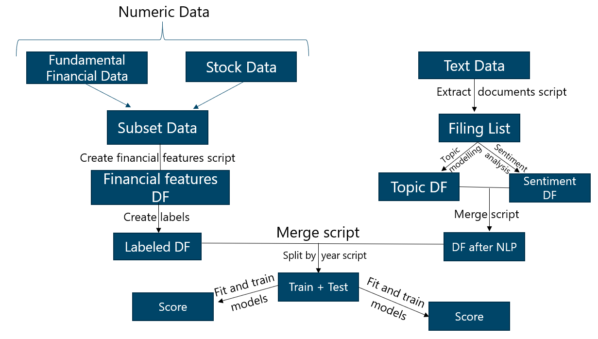
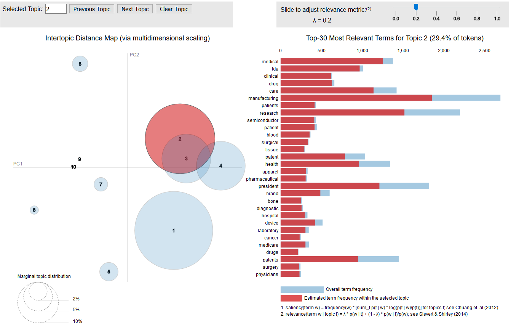
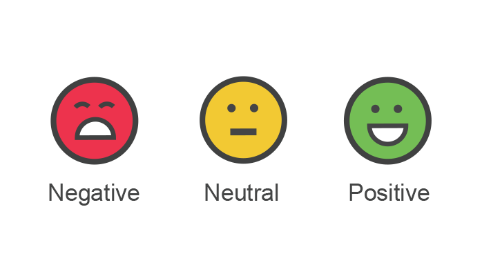
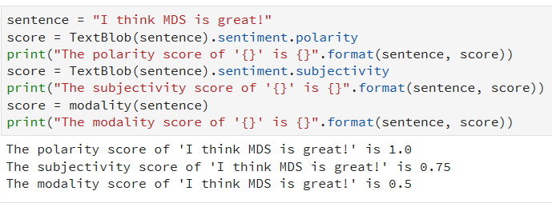

# Sauder School of Business Capstone Project 2018

<h4 align="center"><a>

[Ted Thompson](https://github.com/TeddTech) &nbsp;&nbsp;&nbsp;

</a></h4>

### Overview
The UBC Sauder School of Business group has a large database from the U.S. Securities and Exchange Commission (SEC) fillings, Wharton financial fundamental data, and stock price history. In this project, we seek to build a framework for leveraging SEC filings to obtain industry intelligence. Specifically, we are given two prediction problems: classification of firm survival and predicting firm performance.

### Data
This is a data-intensive project, you can find all files required to run the project in the `/data/` folder.

Many of these can and should be changed depending on the target of your analysis. Please see the data README [here](data/README.md)for more information.

### Scripts

This project can be executed in two main ways, either by using Make (documented [here](doc/make_docs.md)), or by running the python scripts individually (documented [here](src/scripts/README.md)).

A brief overview of the data Pipeline can be seen below:

### Tests
An overview of all unit tests for every function in the project could be found in [here](tests/README.md)

### Techniques

#### Natural Language Processing:

**Topic Analysis**
We use LDA, and NMF to try and model the topics found in item1 and item7 from the SEC filings.

Word distribution testing with 10 topics:
Below is the word distribution of CV-LDA with 1000 filings. The selected topic is topic 2 - medical.

**Sentiment Analysis**
We extract polarity, subjectivity and certainty scores in item1 and item7 from the SEC filings.

An example can be seen as below:

### Dependencies

* [pandas >= v0.22](https://pandas.pydata.org/)
* [numpy >= v1.14.3](http://www.numpy.org/)
* [matplotlib >= v2.1.1](https://matplotlib.org/)
* [mongoengine  >= v0.15](http://mongoengine.org/)
* [missingno >= v0.4.0](https://github.com/ResidentMario/missingno)
* [gensim >= v3.4.0](https://github.com/RaRe-Technologies/gensim)
* [tqdm >= v4.23.2](https://github.com/tqdm/tqdm)
* [keras >= v2.1.6](https://keras.io/)
* [nltk >= v3.3](https://www.nltk.org/)
* [tensorflow >= 1.8.0](https://www.tensorflow.org/)
* [sklearn >= 0.19.1](http://scikit-learn.org/stable/)
* [textblob >= 0.15.1](http://textblob.readthedocs.io/en/dev/)
* [pattern >= 2.6](https://www.clips.uantwerpen.be/pattern)
* [seaborn >= 0.8.1](https://seaborn.pydata.org/)
* [plotly >= 2.7.0](https://plot.ly/#/)
* [bokeh >= 0.12.16](https://bokeh.pydata.org/en/latest/)

### Contributing
To contribute to this project, please see our [Contributing Guidelines](CONTRIBUTING.md)

### Code of Conduct
In the interest of fostering an open and welcoming environment, we as contributors and maintainers pledge to making participation in our project and our community a harassment-free experience for everyone, regardless of age, body size, disability, ethnicity, gender identity and expression, level of experience, education, socio-economic status, nationality, personal appearance, race, religion, or sexual identity and orientation.

For more information, please see our [Code of Conduct](CODE_OF_CONDUCT.md)
