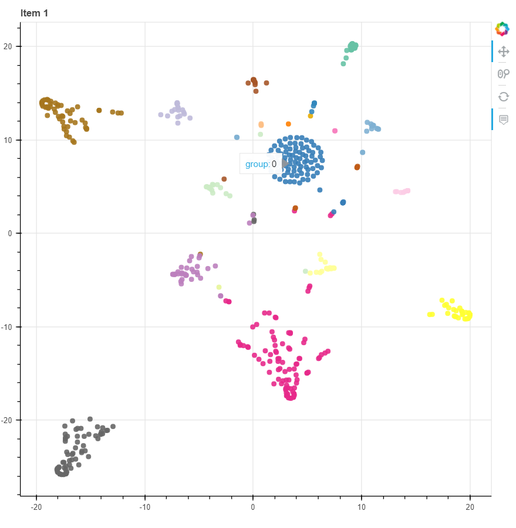
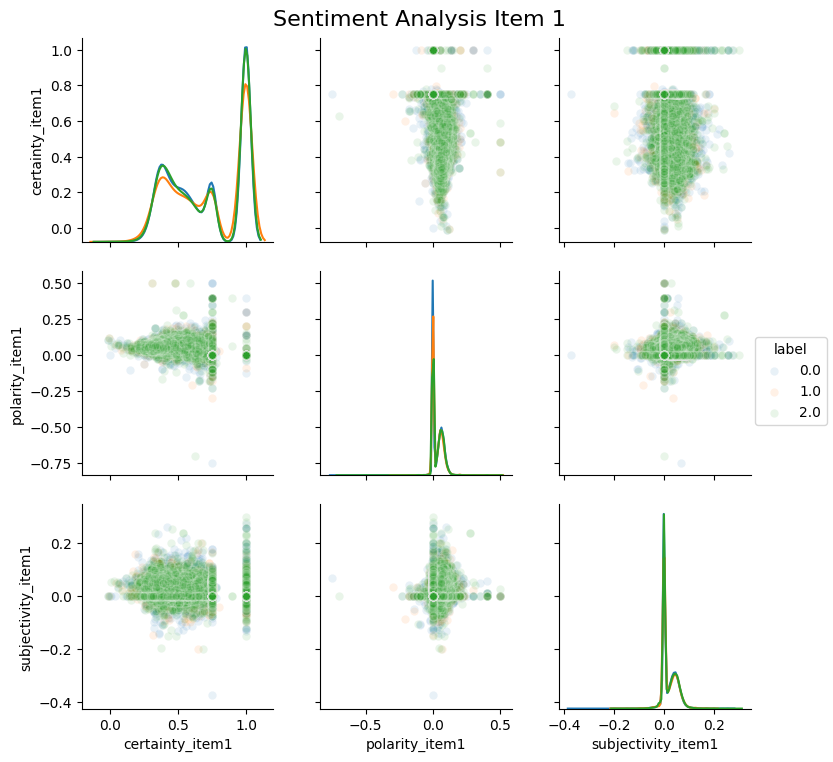
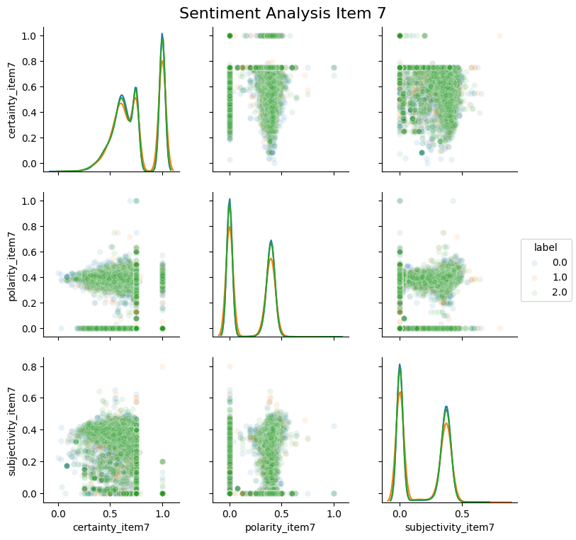

## Sauder School of Business - Capstone Project

### Abstract

In this report, we use several techniques to combine financial data and text data as features to study firm performance. To determine firm performance, we consider it as a discrete problem and label the data using stock price as a proxy for firm performance. For financial data, we have used the features from the following sources: balance sheet, income statement, and statement of cashflows, as well as several new features obtained by computing fundamental financial metrics such as P/E, EV/EBITDA, Debt to Equity Ratio and Profit Margin.

With text data, we focused on the SEC form 10-K. We extracted topics and different sentiment features (positivity, certainty, polarity) from both items as new features.
Using these features, we obtained more insights into the performance of U.S. companies over the period from 1995 to 2017.

Keywords: Fintech, Natural Language Processing, Machine Learning, Topic Modeling, Latent Dirichlet Allocation, Sentiment Analysis

### Problem Statement

The [UBC Sauder School of Business](http://www.sauder.ubc.ca/) group has a large database of [U.S. Securities and Exchange Commission (SEC)](https://www.sec.gov/) fillings, Wharton financial fundamental data, and stock price history. There are more than 11 million text documents and 10GB of numeric data in total. In this project, we focused on predicting firm performance using stock prices as a proxy for performance. The focal point of our project was the more than 11M text filings gathered by our partners at Sauder. In particular, we focused on the SEC 10-K form. We used topic modeling and sentiment analysis to extract new features using item 1 (business overview) and item 7 (management's discussion) from 10-K annual reports. Our predictive models showed a slight improvement of predictive power over the base financial features; however, due to the number of benchmarks we had, further tuning is required to better understand the gains. At the end of the project, we delivered the following products to our partners: the extracted features, predictive models, and a pipeline that reproduces all our results, which can be used to perform similar analyses in the future.

### Literature Review
We have unbalanced panel data as it contains uneven number of observations for different companies. Also, because we have few observations, it is not possible to utilize time series properties for the evolution of each company. In related work, Alberg & Lipton (2017) treated observations as independent in their neural network model.

Kogan, Levin, Routledge, Sagi & Smith (2009) predict risk from financial reports with text regression. In this paper, they extract features from 1-0K reports via TF, TFIDF, and LOG1P which are methods to create scores based on word counts in documents. In this paper, they try to predict risk rather than returns, so their main focus is predicting stock volatility rather than stock return.

Routledge, Sacchetto & Smith (2017) predict merger targets and acquirers from SEC filings. They perform logistic regression with features from text and financial fundamentals. Text features are frequency of words and phrases in the documents. They use Item 7 of 10-K filings which is  "Management’s  Discussion  and  Analysis" for their text analysis, and they replace numbers by '$#' which we will also do in our models. They used the following financial features: Tobin's Q (market value of assets to book value of assets ratio), PPE (book value of property plant and equipment), logarithm of cash balance, debt to asset leverage ratio, market capitalization (size of equity) and return on assets.

### 3 Procedures
#### 3.1 Required Data

Our partners at the Sauder School of Business have parsed more than 11M SEC filings and would like to use the information from this text data, along with fundamental financial features for several of their research projects.

There are 3 main data sources required to run our analysis. All other data needed can be created from these sources. The first is a MongoDB server containing parsed 10-K filings as was provided by our partners. The second is the Compustat and CRSP datasets from Wharton Research Data Services. Finally, we used a SQL database containing metadata regarding the SEC filings.

##### 3.1.1 Numeric Data

###### CRSP Data
* The stock prices data comes from the [Center for Research in Security Prices](https://en.wikipedia.org/wiki/Center_for_Research_in_Security_Prices).
* 64 features of daily frequency with time range from January 1995 to December 2017.

###### Compustat Data
* 645 features contain information from financial statements on a yearly and quarterly basis.
* Ranges from January 1995 to March 2018.

##### 3.1.2 Text documents: SEC Filings
* Raw data includes: 11.7M documents and contain different types of fillings, 532K entities (American firms and investors) in 24K cities
* 164K parsed [10-K](https://en.wikipedia.org/wiki/Form_10-K) filings in MongoDB
* More than 14,000 of these companies have multiple (>3) filings in the period.
* Includes information about the company itself such as sector, as well as discussion by management about risks in the coming year, legal proceedings, and executive compensation among other things. [SEC 10-K Item Descriptions](https://www.sec.gov/fast-answers/answersreada10khtm.html)

#### 3.2 Scientific Objectives

**Extract meaning features from data sources.** These features should be useful in predicting the labels of the models.

**Develop modular pipeline combining data sources that partners can use in their research.** By making the pipeline functionally modular the user is able to adjust the pipeline to fit their analysis accordingly. Swapping out scripts in the pipeline or just changing a few lines of code within some scripts will allow our partners to customize the pipeline for multiple purposes.

**Predictive models to demonstrate the usefulness of extracted features.** The results of the models gives a sense of how well the features extracted are performing. One can use this information to help with interpretability of the features and gauging meaning behind the features.

#### 3.3 Data Science Methods

##### 3.3.1: EDA
Handling with database:
* SQL for compustat & crsp database
* [Pymongo](https://api.mongodb.com/python/current/) for extracting text data
  * If we chose to use other available methods such as Map-Reduce in JavaScript, it will take longer to start (since team members are not familiar with the language).

Data wrangling:
 * We determined that this data has missing value for different reasons. After discussing with our partners, we used the [complete case method](https://en.wikipedia.org/wiki/Imputation_(statistics)) to handle the missing value as the custom industry practice. Another reason to do this is the number of missing values is relatively unnoticeable to the total number of data points.
- However, there are several other ways to handle missing data such as imputing with means, mode value, etc. The downside of those methods is that over time or even among different companies, these value can be different by orders of magnitude, and so using means/ mode will make the data become irrelevant to the rest of the observation and create more noise.

Visualization:
 * We use [matplotlib](https://matplotlib.org/index.html), [seaborn](https://seaborn.pydata.org/), [bokeh](https://bokeh.pydata.org/en/latest/) and [pyLDAvis](https://github.com/bmabey/pyLDAvis) to visualize the result and adjust our choices.
- Other options available are [Dash](https://plot.ly/products/dash/) which we haven't had enough time to explore as it is the least priority of the partners.

##### 3.3.2: Modeling:
 **Natural Language Processing**:
  * [Textblob](http://textblob.readthedocs.io/en/dev/) and [Pattern](https://www.clips.uantwerpen.be/pattern) for **sentiment analysis**

      We use three types of score for sentiment analysis:

      1) Polarity: negative vs. positive    (-1.0 => +1.0)
      2) Subjectivity: objective vs. subjective (+0.0 => +1.0)
      3) Modality: certainty vs. uncertainty(-1.0 => +1.0)
      Grammatical mood refers to the use of verbs like could, would, etc and adverbs like definitely, maybe, etc to express uncertainty.

  * [Gensim](https://radimrehurek.com/gensim/) and [SK-Learn](http://scikit-learn.org/stable/index.html) for **topic modeling**

     We use three ways to perform topic modeling:

     1) LDA from gensim model: even after tuning and adding financial stopwords, topics produced by this library are still highly overlapped and does not make sense.
     2) CountVectorizer and LDA from sklearn library: with a little tuning, the result is very promising and topics are very distinguish.
     3) TF-IDF with NMF model from sklearn library: this is the best method among all that we tried. Without any tuning or special stopwords, the model is still able to provide different topics.

**Predictions**:
The prediction models we delivered are means to measure the usefulness of our new features. We fit and train different models with different combination of new financial features, topic features and 3 different sentiment scores. Libraries and models that we incorporate in our pipeline are:

  * Sklearn libray:
    - Logistic Regression: simple, easy to interpret and good results
    - K-Nearest Neighbors: simple, easy to use but not quite suitable for high dimensional data.
    - Random Forest: Overfitting problem
    - Support Vector Machine (SVM): good results but processing time is slow
  * [Keras library](https://keras.io/):
    - Feed Forward Neural Network: potentially good result but not yet in best shape due to time constraint. This model still has overfitting problem (probably because of too many neural nodes)

### 4.0 Data Product

For our project, we had three main data products:

1. A set of features extracted from the text data gathered by Sauder School of Business.
2. A reusable framework which our partners can utilize to recreate our findings, and perform similar analyses in the future to obtain industry intelligence.
3. Predictive models to demonstrate usefulness of extracted features.

##### 4.1: New Features

We have performed feature engineering on accounting and market information from Compustat and CRSP. We have these new features and performed the predictive models on these features which the researcher can decide which features are the best for his/her analysis.

Topic modeling and sentiment analysis are the methods we used to extract new information from item1 (business overview) and item7 (year-end discussion) of 10K annual reports.

Below is the topic distribution of item 1 for 30 topics, showing how spare these topics are in our subset. We use [TSNE](https://en.wikipedia.org/wiki/T-distributed_stochastic_neighbor_embedding) to decrease the dimension before plotting with [Bokeh](https://bokeh.pydata.org/en/latest/). This kind of plot helps us to discover how distinguish each topic are and whether the number of topic make sense.

For topic modeling, we performed LDA and NMF to extract topics for each filings separated with item 1 and item 7 and turn the models accordingly. For each filings, we extracts each topic weights as its new feature. So the number of new topic feature is the number of topic that user chose to extract.

Our features for sentiment analysis specifically measure polarity, subjectivity and modality in both item1 and item7, but we believe item7 will contain more sentiment information. Polarity scales the positive and negative of the document, subjectivity score reflects the view point of the document, whether it's an objective document or not. Modality scores calculate the uncertainty of the documents.

Below is the pairwise plot of different sentiment scores for item 1 - Business Overview. This plot shows the correlations between different scores with each other and the distribution of labels.

Below is the pairwise plot of different sentiment scores for item 7 - Year end discussion. Similarly, we want to show the correlations between different scores for item 7 in comparison with scores of item 1. We can see that item 7 (year end discussion) tends to be more positive than item 1 (business overview).

##### 4.2: Data Pipeline

Data pipeline for the project allows researcher to be able to perform several different predictive models within a short amount of time. Although our project is focusing on firm performance prediction, the pipeline allows to change the target variable for a different question.

The pipeline includes 12 scripts, divided into 3 sections: preprocessing numeric, preprocessing text and modeling. For more information and descriptions, please review [here](https://github.com/UBC-MDS/capstone-sauder-2018/tree/master/src) or the main [ReadMe](https://github.com/UBC-MDS/capstone-sauder-2018/blob/master/README.md)

In our pipeline, we take the temporal aspect of the data into consideration while we perform train and test split operations. As more recent documents will have direct or indirect information related to past, test/training split has to be performed carefully. Therefore, we split data into test and train based on year to prevent any information leakage into training data from test data.

##### 4.3 Predictive Models:

The predictive models were delivered as a set of scripts that enable researchers to run any type of predictive model to assess the usefulness of the new extracted features. These models have been tuned to use the financial features using grid search in order to find the best hyperparameters. Due to time constraints, we have used these hyperparameters for all our models. In the future, more time should be given to tuning the models for each of the feature sets. Preliminary result can be found in our [lab diary](https://github.com/UBC-MDS/capstone-sauder-2018/blob/master/doc/Lab_Diary.md)

The labels for the response variable for this project are _down_ (encoded as 0), _flat_ (encoded as 1), and _up_ (encoded as 2), corresponding to the percentage change from the previous period for each firm. These were decided using a flat 10% increase or decrease over the previous period. Currently, we have unbalanced dataset with more than double the number of companies labelled up/ down than flat. Further work may benefit from changing the labelling function to incorporate market returns to better identify extreme events.

The models we used were as follows:

_k-Nearest neighbours_: While this model performed well on a small subset of the financial features and the data, we found that when incorporating all the data and our full feature set hindered the ability of this model due to the high dimensionality, which k-NN tends to be bad at. Except for on these small subsets, where this model was able to achieve around 40-45% accuracy, this model did not perform well at all. On the full set of the data, we were finding that both train and test accuracy was around 33-35%. This is up from the 30-33% that was achieved by the financial features alone, but is not particularly meaningful because it is still roughly an even split between classes. Our grid-search told us that the optimal number of neighbours to look for was around 20, but due to the nature of the data, this is likely to be mostly other observations from the same company, and perhaps a small number from another, very similar company. We believe that using a simpler 4 factor model, as is currently popular in financial literature, and incorporating our additional features may fix the issue of high-dimensionality. In addition, a higher value for k might be beneficial in this particular case where there are many observations from a single company, although you must still keep an eye on the approximation error (training error - test error) to avoid overfitting.

_Logistic Regression_: We favoured this model because of its interpretability and simplicity. It performed quite well. Two key points to note are that we found best results with L2-regularization, so rather than setting unimportant features' coefficients to 0, we set them to an arbitrarily small value. In this case, we likely would've gotten better results with further feature selection so as not to include features that were just adding noise. We also found that our regularization parameter (C for sklearn, which is equivalent to 1/lambda) was optimal at 1, and performed worse for both smaller and larger values. Smaller values of C correspond to a high regularization penalty (meaning large coefficients are penalized more), and likewise, large values of C correspond to a low regularization penalty. With even an untuned Logistic Regression, we were able to achieve a test cross-entropy score of 8.61 on just our financial data, which is much better than the Random Forest's score of 10 on the same subset.

_Random Forest Classifier_: We found that there was significant overfitting with this model, even when severely limiting the maximum depth of the tree. Our best models had `max depth`=5, and we still had a large approximation error (training error - test error). We were continually getting around 98% accuracy on our training set, but only around 40% accuracy on a test set. Further tuning and reducing the depth of our trees was unable to fix this issue. For future work, it might be useful to look at some sample trees in order to look at the decision stumps being created which may aid in diagnosing this overfitting.

_SVM_: Our SVM classifier used an RBF kernel, however due to the incredibly long training times, we were not able to tune this model sufficiently. Using the sklearn defaults for most things and just tuning regularization penalty, we found again that a regularization parameter of 1 was optimal for all the cases tried. On our test subsets, we were achieving around 40-45% accuracy on the financial data alone, and including our features improved this to 45-50%. Training accuracy was roughly the same, telling us that our model has not overfit. However, when running on the full dataset, training was prohibitively expensive, and even on the server we were unable to perform grid search on this model with the time provided. Random Search or Bayesian optimization would likely help to speed up hyperparameter optimization time, and get more concrete results from this model.

_Feed Forward Neural Network_: Our final model was a feed forward neural network in Keras. For this model, we started with a simple, 2 hidden layer architecture with 50 neurons in each layer. With this model, there was also quite a bit of overfitting, as we were getting 50-60% accuracy on our trainig set, and only between 40-50% with the financial data alone. We incorporated dropout layers into the Keras CLI in order to try and mitigate this issue, however we were not sufficiently able to test this out. Adding all of our features into the feature set, we increased test accuracy by around 2-3% consistently, but our approximation error did not decrease, telling us that overfitting was still a significant issue.

### 5.0 Conclusion
Our predictive models showed a slight improvement of predictive power over the base financial features, however due to the number of benchmarks we had, further tuning is required to better understand the information gains. The percentages given above are using the training and test set, which may include some optimization bias due to the tuning of our models. In order to get unbiased accuracy metrics, a final prediction run should be performed on each of the models using the validation set with the final year of data.

### 6.0 Future Works
#### Preprocessing:
* A more targeted look at Item 1A rather than Item 1 as a whole may be warranted because of Item 1A's focus on business risks. We currently perform sentiment analysis and topic modeling on Item 1 and Item 7, however the topics or sentiment in Item 1 may be overwhelmed by the discussion of business operations.

* Embedding spaces is an area of potential interest for future research, as it may to a better job at capturing semantic differences between company's filings.

* Better treatment of confounding variables such as industry or year might be in order. We chose to ignore most time series effects of our data, as in [Alberg & Lipton (2017)](https://doi.org/10.1109/ICCV.2017.627) who treated observation as independent in their neural network model.

* We have used Complete Case imputation following industry's standard, which is simply dropping not available data. Mean or median imputation methods would definitely not increase prediction power due to nature of data such as we have companies with various sizes. However, more intelligent ways of imputation methods can be implemented based on industry benchmarks in combination with period aveage.

* For tokenization, we used nltk provided stopwords list with some additional financial stopwords. However, company names should be also considered in this list as some companies' name introduce noise to the sentiment analysis (Best Buy, The Boring Company, BetterHealth, etc.)

#### Modeling
* Building a dashboard to be able to visualize extract features interactively to gain better insights.

* Firm survival analysis can be done by using our pipeline with delisting reason information from Compustat data which we discovered later on after discussion with our partners.

* More nuanced approach to dealing with the time-series data. Our method treated performance in a given year as independent of performance in previous years.

* In [Alberg & Lipton (2017)](https://doi.org/10.1109/ICCV.2017.627)'s setup, input data comes in sequence how a company's financials evolves over time and distribution of returns are conditioned by evolution of these RNN (Recurrent Neural Network) sequences. It may be a good reference point to extent our models and apply RNN.

### References

Alberg, J., & Lipton, Z. C. (2017). Improving Factor-Based Quantitative Investing by Forecasting Company Fundamentals, (Nips). https://doi.org/10.1109/ICCV.2017.627

Catherine XIAO, Mar 21, 2018, Read 10K using CNN, 1:04. https://www.youtube.com/watch?v=3ZjGLQf7FcA

Donaldson, D., & Storeygard, A. (2016). The View from Above: Applications of Satellite Data in Economics. Journal of Economic Perspectives, 30(4), 171–198. https://doi.org/10.1257/jep.30.4.171

Kogan, S., Levin, D., Routledge, B. R., Sagi, J. S., & Smith, N. a. (2009). Predicting Risk from Financial Reports with Regression. Proceedings of North American Chapter of the Association for Computational Linguistics, 272–280. https://doi.org/10.3115/1620754.1620794

Lee, G. M., Nigam, Y., Kapoor, D., & Seo, J. (2017). SEC Filings Text Analytics for U . S . Industry Intelligence : A Preliminary Report, 1–6.

Li, K. K., & Mohanram, P. (2014). Evaluating cross-sectional forecasting models for implied cost of capital. Review of Accounting Studies, 19(3), 1152–1185. https://doi.org/10.1007/s11142-014-9282-y

Loughran, T., & Mcdonald, B. (2016). Textual Analysis in Accounting and Finance: A Survey. Journal of Accounting Research, 54(4), 1187–1230. https://doi.org/10.1111/1475-679X.12123

Mcdowell, B., Kong, L., Routledge, B. R., & Smith, N. A. (2014). Extracting a Corporate Social Network from Text, 1994.

Routledge, B. R., Sacchetto, S., & Smith, N. A. (n.d.). Predicting Merger Targets and Acquirers from Text. Working Paper, 1–16.

Shi, Z., Lee, G. M., & Whinston, A. B. (2016). Toward A Better Measure of Business Proximity: Topic Modelling for Industry Intelligence. Main, 40(4), 1035–1056.

Xiang, G., Zheng, Z., Wen, M., Hong, J., & Rose, C. (2005). A Supervised Approach to Predict Company Acquisition with Factual and Topic Features Using Profiles and News Articles on TechCrunch. Artificial Intelligence, 607–610.

Zhu, C. (2018). Big Data as a Governance Mechanism. Job Market Paper.
